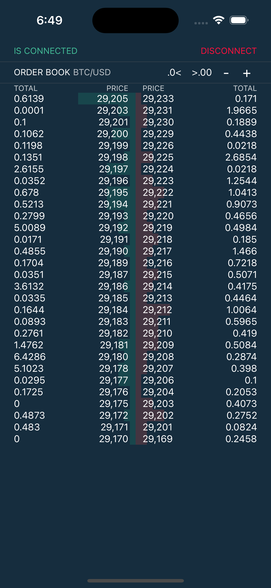

# Bitfinex Application

This is a simple Bitfinex application built using React-Native and Expo.

#### Application screenshot

<span>
    
</span>

## How to Run the Project Locally

To run this project locally, please follow these steps:

1. Clone this repository to your local machine using the following command
```bash
git clone git@github.com:chocky335/bitfinex-app.git
```
2. Install the required dependencies by running the following command:

```bash
cd bitfinex-app/
yarn
```
3. Start the Expo development server by running the following command:
```bash
yarn start
```
4. Use the Expo app on your mobile device to scan the QR code displayed in your terminal or browser. Alternatively, you can use an emulator or simulator to run the application.
<br><br>
**Note**: You need to have the Expo app installed on your mobile device to run the application. You can download it from the App Store or Google Play Store.

5. Once the application is running, you should be able to seeyour connection status and Order Book widget.

That's it! You now have the Bitfinex running on your local machine.


